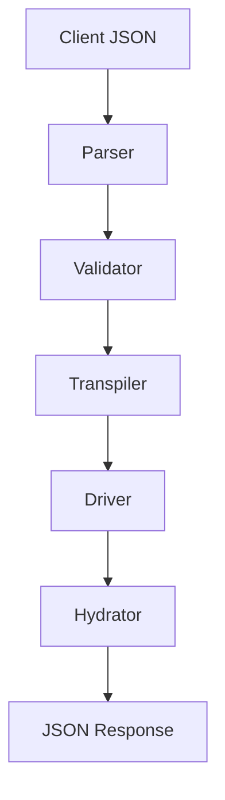
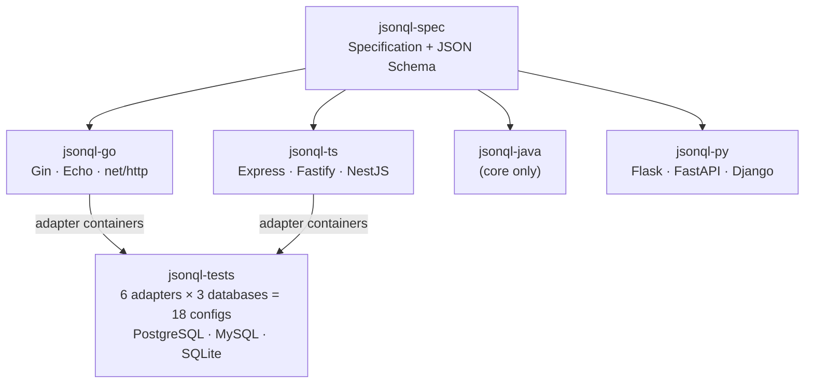

JSONQL is a layered system with a clear separation of concerns. Every SDK (Go, TypeScript, Java, Python) implements the same pipeline, ensuring consistent behavior across languages.

## Pipeline

1. **Client** sends a JSONQL query as JSON (via POST body or `?q=` query param).
2. **Parser** validates the query structure — field names, operators, nesting depth, limits.
3. **Validator** checks schema permissions — is this field selectable? Can this relation be included? Is aggregation allowed?
4. **Transpiler** converts the JSONQL query into dialect-specific SQL (Postgres, MySQL, SQLite, or MSSQL) or MongoDB aggregation pipeline, with parameterized arguments.
5. **Driver** executes the SQL against the database and returns flat rows.
6. **Hydrator** takes the flat SQL result set and reconstructs nested JSON, reassembling relationship data from JOINs.

## Components

| Component | Responsibility | Present in |
|-----------|---------------|------------|
| **Parser** | Validate query shape, types, and security limits | All SDKs |
| **Validator** | Schema-based permission checking (fields, relations, aggregates) | All SDKs |
| **Transpiler** | JSONQL → SQL conversion with dialect awareness | All SDKs |
| **Dialect** | Database-specific SQL syntax (placeholders, quoting, RETURNING) | All SDKs |
| **Driver** | Database connection and query execution | Go, TS |
| **Hydrator** | Flat rows → nested JSON reconstruction | All SDKs |
| **Builder** | Fluent API for constructing JSONQL queries programmatically | All SDKs |
| **Schema** | Table/field/relation definitions with permissions | All SDKs |
| **Adapter** | Framework-specific HTTP integration (routing, request parsing) | All SDKs |
| **Engine** | Unified pipeline orchestrator (parse → validate → transpile → execute → hydrate) | TS, Java, Python |

## Ecosystem Map

## Cross-SDK Feature Matrix

| Feature | Go | TypeScript | Java | Python |
|---------|:--:|:----------:|:----:|:------:|
| Parser | ✅ | ✅ | ✅ | ✅ |
| Validator | ✅ | ✅ | ✅ | ✅ |
| QueryBuilder | ✅ | ✅ | ✅ | ✅ |
| MutationBuilder | ✅ | ✅ | ✅ | ✅ |
| SQL Transpiler | ✅ | ✅ | ✅ | ✅ |
| Result Hydrator | ✅ | ✅ | ✅ | ✅ |
| Schema Validation | ✅ | ✅ | ✅ | ✅ |
| Lifecycle Hooks | ✅ | ✅ | ✅ | ✅ |
| Postgres dialect | ✅ | ✅ | ✅ | ✅ |
| MySQL dialect | ✅ | ✅ | ✅ | ✅ |
| SQLite dialect | ✅ | ✅ | ✅ | ✅ |
| MSSQL dialect | ✅ | ✅ | ✅ | ✅ |
| MongoDB transpiler | ✅ | ✅ | ✅ | ✅ |
| Framework adapters | 3 | 3 | 0 | 3 |

## Security Model

Every SDK enforces:

- **Parameterized queries** — all user values are bound as parameters, never interpolated into SQL
- **Schema permissions** — fields, relations, and aggregates are allow-listed
- **Nesting limits** — configurable `maxNestingDepth` prevents DoS via deeply nested queries
- **Pagination limits** — configurable `maxLimit` prevents unbounded result sets
- **No eval / no regex execution** — queries are data, not code

## Observability

JSONQL encourages deterministic query plans and structured logging:

- Each SDK provides a logger interface for SQL tracing
- Lifecycle hooks enable instrumentation at parse, transpile, and execute stages
- The Java and Python SDKs support `debug()` mode for development logging
