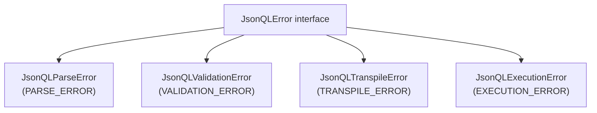

The official Go SDK for JSONQL. A few lines of configuration give your API dynamic filtering, sorting, pagination, field selection, and relationships — no custom handlers needed.

| | |
|---|---|
| **Module** | `github.com/jsonql-standard/jsonql-go` |
| **Go version** | 1.24+ |
| **License** | MIT |
| **Spec** | JSONQL v1.1 |

## Install

```bash
go get github.com/jsonql-standard/jsonql-go
```

## Configure & Use

Pick your framework — a few lines give you a complete JSONQL API:

### Gin

```go
package main

import (
    "github.com/gin-gonic/gin"
    "github.com/jsonql-standard/jsonql-go/adapters/gin"
    "github.com/jsonql-standard/jsonql-go/adapters/http"
    "github.com/jsonql-standard/jsonql-go/drivers/postgres"
)

func main() {
    driver, _ := postgres.NewDriver("postgres://localhost/mydb?sslmode=disable")
    defer driver.Close()

    handler, _ := gin.Handler(http.AdapterOptions{Driver: driver})

    r := gin.Default()
    r.NoRoute(handler) // All routes handled automatically
    r.Run(":8080")
}
```

### Echo

```go
package main

import (
    "github.com/labstack/echo/v4"
    jsonqlecho "github.com/jsonql-standard/jsonql-go/adapters/echo"
    "github.com/jsonql-standard/jsonql-go/adapters/http"
    "github.com/jsonql-standard/jsonql-go/drivers/postgres"
)

func main() {
    driver, _ := postgres.NewDriver("postgres://localhost/mydb?sslmode=disable")
    defer driver.Close()

    handler, _ := jsonqlecho.Handler(http.AdapterOptions{Driver: driver})

    e := echo.New()
    e.Any("/*", handler) // Catch-all — table name from URL path
    e.Start(":8080")
}
```

### net/http

```go
package main

import (
    "net/http"
    jsonqlhttp "github.com/jsonql-standard/jsonql-go/adapters/http"
    "github.com/jsonql-standard/jsonql-go/drivers/sqlite"
)

func main() {
    driver, _ := sqlite.NewDriver("./my.db")
    defer driver.Close()

    handler, _ := jsonqlhttp.Handler(jsonqlhttp.AdapterOptions{Driver: driver})

    http.Handle("/", handler)
    http.ListenAndServe(":8080", nil)
}
```

**That's it.** One driver, one handler mount. Your clients can now query any table dynamically.

## What Your Clients Can Do

Every query is a JSON POST to `/{table}`:

```bash
# Select specific fields, filter, sort, paginate
curl -X POST http://localhost:8080/users -H 'Content-Type: application/json' -d '{
  "fields": ["id", "name", "email"],
  "where": { "status": { "eq": "active" } },
  "sort": ["-created_at"],
  "limit": 20
}'
# → { "data": [{ "id": 1, "name": "Alice", "email": "alice@co.com" }, ...] }
```

```bash
# Complex filters
curl -X POST http://localhost:8080/products -d '{
  "where": {
    "and": [
      { "price": { "gte": 10, "lte": 100 } },
      { "category": { "in": ["electronics", "books"] } }
    ]
  },
  "sort": ["price"],
  "limit": 50
}'
```

```bash
# Include related data — joins resolved automatically
curl -X POST http://localhost:8080/users -d '{
  "fields": ["id", "name"],
  "include": {
    "posts": { "fields": ["title", "created_at"], "limit": 5 }
  }
}'
```

```bash
# Aggregation & groupBy
curl -X POST http://localhost:8080/orders -d '{
  "aggregate": { "total": { "fn": "sum", "field": "amount" } },
  "groupBy": ["status"]
}'
```

CRUD mutations:

```bash
# Create
curl -X POST http://localhost:8080/users \
  -d '{ "data": { "name": "Bob", "email": "bob@co.com" } }'

# Update
curl -X PATCH http://localhost:8080/users \
  -d '{ "patch": { "status": "inactive" }, "where": { "id": { "eq": 1 } } }'

# Delete
curl -X DELETE http://localhost:8080/users \
  -d '{ "where": { "id": { "eq": 1 } } }'
```

## Adding Schema (Optional)

Without schema, all columns are queryable. With schema, you control which fields are exposed, enable relationship resolution, and restrict access:

```go
handler, _ := gin.Handler(http.AdapterOptions{
    Driver: driver,
    Schema: &jsonql.JSONQLSchema{
        Tables: map[string]*jsonql.JSONQLTable{
            "users": {
                Fields: map[string]*jsonql.JSONQLField{
                    "id":    {Type: "number"},
                    "name":  {Type: "string"},
                    "email": {Type: "string"},
                },
                Relations: map[string]*jsonql.JSONQLRelation{
                    "posts": {Type: "hasMany", Table: "posts", Field: "user_id"},
                },
            },
        },
    },
})
```

## Lifecycle Hooks

Inject tenant isolation, audit logging, or custom logic:

```go
handler, _ := gin.Handler(http.AdapterOptions{
    Driver: driver,
    Hooks: &jsonql.Hooks{
        BeforeQuery: func(query map[string]any, table string) {
            // Add tenant filter to every query
            query["where"] = map[string]any{
                "and": []any{query["where"], map[string]any{"tenant_id": map[string]any{"eq": tenantID}}},
            }
        },
    },
})
```

## Supported Databases

| Database | Import Path | Underlying Driver |
|----------|-------------|-------------------|
| **PostgreSQL** | `drivers/postgres` | `github.com/lib/pq` |
| **MySQL** | `drivers/mysql` | `github.com/go-sql-driver/mysql` |
| **SQLite** | `drivers/sqlite` | `modernc.org/sqlite` |
| **MSSQL** | `drivers/mssql` | `github.com/microsoft/go-mssqldb` |
| **MongoDB** | `drivers/mongodb` | `go.mongodb.org/mongo-driver` |

## Error Handling

All errors implement `JsonQLError` with a `Code() string` method:



```go
var jsonqlErr jsonql.JsonQLError
if errors.As(err, &jsonqlErr) {
    fmt.Println(jsonqlErr.Code()) // "VALIDATION_ERROR"
}
```

Adapter error responses:

```json
{ "error": "Field 'secret' is not allowed", "error_code": "VALIDATION_ERROR" }
```

## Advanced: Engine (Programmatic Use)

For custom pipelines outside the adapters:

```go
engine := jsonql.NewEngineBuilder().
    Postgres().
    Schema(schema).
    Executor(func(ctx context.Context, sql string, args []interface{}) (*sql.Rows, error) {
        return db.QueryContext(ctx, sql, args...)
    }).
    Build()

result, err := engine.Execute(ctx, "users", queryMap)
// result.Data       — []map[string]interface{}
// result.IsMutation — bool
```

## Advanced: Query Builder

For server-side programmatic query construction:

```go
import "github.com/jsonql-standard/jsonql-go/builder"

q := builder.New().
    From("users").
    Select("id", "name", "email").
    Where(map[string]any{"status": map[string]any{"eq": "active"}}).
    OrderBy("-created_at").
    Limit(10).
    Build()
```

## Core API

| Type | Purpose |
|------|---------|
| `AdapterOptions` | Configure adapter: driver, schema, hooks |
| `Driver` interface | Database abstraction: `Query()`, `Execute()`, `Close()` |
| `Engine` / `EngineBuilder` | Programmatic transpile-and-execute pipeline |
| `Parser` | Parse & validate incoming JSON |
| `Transpiler` | Convert parsed query → SQL + args |
| `Hydrator` | Convert flat rows → nested JSON |
| `QueryBuilder` | Fluent query construction (advanced) |

## Compliance

135/135 tests passing across all configurations:

| Adapter | PostgreSQL | MySQL | SQLite | MSSQL | MongoDB |
|---------|:----------:|:-----:|:------:|:-----:|:-------:|
| **Gin** | ✅ | ✅ | ✅ | ✅ | ✅ |
| **Echo** | ✅ | ✅ | ✅ | ✅ | ✅ |
| **net/http** | ✅ | ✅ | ✅ | ✅ | ✅ |

## Development

```bash
make test             # Run all tests
go vet ./...          # Static analysis (CI enforced)
gofmt -w .            # Auto-format
```

## Architecture

The SDK is organised into 12 canonical modules. A request flows through them in order:

```
parser → validator → transpiler → driver → drivers → hydrator
                            ↑ factory / engine wires it together
                            ↑ builder is an alternative input
```

| Module | File | Purpose |
|--------|------|---------|
| **parser** | `parser.go` | Tokenise & validate incoming JSON, produce an AST |
| **validator** | embedded in parser & schema | Schema & permission checks against the AST |
| **transpiler** | `transpiler.go` | AST → parameterised SQL for the active dialect |
| **mongo_transpiler** | `mongo_transpiler.go` | AST → MongoDB filter & aggregation pipelines |
| **dialect** | `dialect.go` | Per-flavour quoting & parameter markers (Postgres `$1`, MySQL/SQLite `?`, MSSQL `@p1`) |
| **driver** | `driver.go` | `Driver` interface: `Query`, `Execute`, `Close` |
| **drivers** | `drivers/{postgres,mysql,sqlite,mssql,mongodb}` | Concrete backends |
| **hydrator** | `hydrator.go` | Flatten join rows back into nested maps |
| **factory** / **engine** | `factory.go`, `engine.go` (`NewEngineBuilder()`) | One-call wiring of parser + transpiler + driver + hydrator |
| **builder** | `builder/` | Fluent `QueryBuilder` for programmatic queries |
| **schema** | `schema.go`, `schema/` | Optional schema loader (introspection + JSON) |
| **adapters** | `adapters/{gin,echo,http}` | Framework integrations |
| **errors** | `errors.go` | `JsonQLError` interface with `Code()` |

For most apps you only touch **adapters** at install time and the **factory** / engine for advanced wiring. Everything else is automatic.

## Repo

[`github.com/jsonql-standard/jsonql-go`](https://github.com/JSONQL-Standard/jsonql-go)
