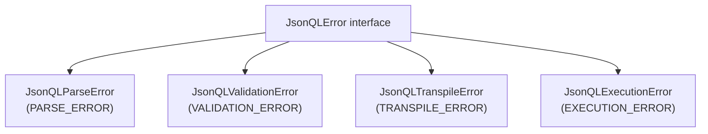

The official Go implementation of the JSONQL Standard. Full v1.1 support with a modular pipeline architecture.

| | |
|---|---|
| **Module** | `github.com/jsonql-standard/jsonql-go` |
| **Go version** | 1.24+ |
| **License** | MIT |
| **Spec** | JSONQL v1.1 |

## Features

- Full JSONQL v1.1: selects, includes (relationships), filtering, sorting, pagination, aggregation, groupBy, distinct
- Database agnostic with pluggable `Driver` interface (PostgreSQL, MySQL, SQLite, MSSQL, MongoDB drivers included)
- Framework adapters for **Gin**, **Echo**, and **net/http**
- Schema-based validation and SQL injection prevention (parameterized queries)
- Fluent `QueryBuilder` and `MutationBuilder` APIs
- Result hydrator for nested JSON reconstruction from flat SQL rows
- Lifecycle hooks: `BeforeQuery`, `AfterQuery`, `BeforeCreate`/`Update`/`Delete`, `AfterCreate`/`Update`/`Delete`
- Schema introspection and file-based schema loading

## Installation

```bash
go get github.com/jsonql-standard/jsonql-go
```

## Quick Start

```go
package main

import (
	"database/sql"
	"log"

	"github.com/gin-gonic/gin"
	"github.com/jsonql-standard/jsonql-go"
	jsonqlgin "github.com/jsonql-standard/jsonql-go/adapters/gin"
	"github.com/jsonql-standard/jsonql-go/drivers/sqlite"
	_ "modernc.org/sqlite"
)

func main() {
	schema := &jsonql.JSONQLSchema{
		Tables: map[string]*jsonql.JSONQLTable{
			"users": {
				Fields: map[string]*jsonql.JSONQLField{
					"id":    {Type: "number"},
					"name":  {Type: "string"},
					"email": {Type: "string"},
				},
				Relations: map[string]*jsonql.JSONQLRelation{
					"posts": {Type: "hasMany", Table: "posts", Field: "user_id"},
				},
			},
		},
	}

	driver, _ := sqlite.NewDriver("./my.db")

	handler, _ := jsonqlgin.NewHandler(jsonqlgin.HandlerOptions{
		Driver: driver,
		Schema: schema,
	})

	r := gin.Default()
	r.POST("/api/jsonql", handler)
	r.Run(":8080")
}
```

## Architecture

The SDK follows a modular pipeline:

1. **Parser** — validates the incoming JSON query against the schema
2. **Transpiler** — converts the JSONQL query into dialect-specific SQL
3. **Driver** — executes the SQL against the database
4. **Hydrator** — reconstructs nested JSON from flat result rows

## Core API

| Type | Purpose |
|------|---------|
| `JSONQLQuery` | Query struct: fields, where, sort, limit, offset, aggregate, groupBy, include, distinct |
| `JSONQLMutation` | Mutation struct: op, data, patch, where |
| `JSONQLSchema` / `JSONQLTable` / `JSONQLField` | Schema definition types |
| `Parser` | Parse & validate incoming JSON |
| `ParserOptions` | Security limits: `MaxNestingDepth`, `MaxLimit`, `AllowedFields`, `AllowedIncludes` |
| `Transpiler` | Convert parsed query → SQL + args |
| `Hydrator` | Convert flat `sql.Rows` → nested JSON maps |
| `Validator` | Schema-based permission checking |
| `Driver` interface | `Query()`, `Execute()`, `Close()` |
| `SQLDialect` interface | `Placeholder()`, `QuoteIdentifier()`, `SupportsReturning()` |
| `Engine` | High-level transpile-and-execute pipeline |
| `EngineBuilder` | Fluent builder for `Engine` configuration |
| `EngineResult` | Wraps results: `Data`, `IsMutation` |
| `JsonQLError` interface | Base error interface with `Code() string` |
| `JsonQLValidationError` | Validation failures with `Errors []ValidationError` |
| `JsonQLParseError` | JSON parse errors |
| `JsonQLTranspileError` | SQL/Mongo transpilation errors |
| `JsonQLExecutionError` | Database execution errors with `Cause` |

## Supported Databases

| Database | Import Path | Driver |
|----------|-------------|--------|
| **PostgreSQL** | `github.com/jsonql-standard/jsonql-go/drivers/postgres` | `github.com/lib/pq` |
| **MySQL** | `github.com/jsonql-standard/jsonql-go/drivers/mysql` | `github.com/go-sql-driver/mysql` |
| **SQLite** | `github.com/jsonql-standard/jsonql-go/drivers/sqlite` | `modernc.org/sqlite` |
| **MSSQL** | `github.com/jsonql-standard/jsonql-go/drivers/mssql` | `github.com/microsoft/go-mssqldb` |
| **MongoDB** | `github.com/jsonql-standard/jsonql-go/drivers/mongodb` | `go.mongodb.org/mongo-driver` |

## Framework Adapters

| Framework | Import Path |
|-----------|-------------|
| **Gin** | `github.com/jsonql-standard/jsonql-go/adapters/gin` |
| **Echo** | `github.com/jsonql-standard/jsonql-go/adapters/echo` |
| **net/http** | `github.com/jsonql-standard/jsonql-go/adapters/http` |
| **MongoDB (native)** | `github.com/jsonql-standard/jsonql-go/adapters/mongo` |

## Engine

The `Engine` provides a high-level pipeline that combines parsing, transpilation, and execution:

```go
import "github.com/jsonql-standard/jsonql-go"

engine := jsonql.NewEngineBuilder().
    Postgres().
    Schema(schema).
    Executor(func(ctx context.Context, sql string, args []interface{}) (*sql.Rows, error) {
        return db.QueryContext(ctx, sql, args...)
    }).
    Build()

result, err := engine.Execute(ctx, "users", queryMap)
// result.Data       — []map[string]interface{}
// result.IsMutation — bool
```

The builder supports `.Postgres()`, `.MySQL()`, `.SQLite()`, `.MSSQL()`, `.Driver(d)`, `.Schema(s)`, `.Executor(fn)`, and `.Debug(true)`.

## Error Handling

All errors implement the `JsonQLError` interface with a `Code() string` method:



Check error codes programmatically:

```go
var jsonqlErr jsonql.JsonQLError
if errors.As(err, &jsonqlErr) {
    fmt.Println(jsonqlErr.Code()) // "VALIDATION_ERROR"
}
```

Framework adapters include the `error_code` field in error responses:

```json
{
  "error": "Field 'secret' is not allowed",
  "error_code": "VALIDATION_ERROR"
}
```

## Query Builder

```go
import "github.com/jsonql-standard/jsonql-go/builder"

q := builder.New().
	From("users").
	Select("id", "name", "email").
	Where(map[string]any{"status": map[string]any{"eq": "active"}}).
	AndWhere(map[string]any{"age": map[string]any{"gte": 18}}).
	OrderBy("-created_at").
	Limit(10).
	Build()
```

## Compliance

All 3 framework adapters × 5 databases + 3 lifecycle containers = **18 configurations** pass **135/135** compliance tests.

| Adapter | PostgreSQL | MySQL | SQLite | MSSQL | MongoDB |
|---------|:----------:|:-----:|:------:|:-----:|:-------:|
| **Gin** | ✅ 135/135 | ✅ 135/135 | ✅ 135/135 | ✅ 135/135 | ✅ 135/135 |
| **Echo** | ✅ 135/135 | ✅ 135/135 | ✅ 135/135 | ✅ 135/135 | ✅ 135/135 |
| **net/http** | ✅ 135/135 | ✅ 135/135 | ✅ 135/135 | ✅ 135/135 | ✅ 135/135 |

Lifecycle tests (Gin, Echo, net/http × PostgreSQL) also pass.

## Development

### Build & Test

```bash
make test             # Run all tests (go test with gotestsum)
go build ./...        # Build all packages
```

### Formatting & Linting

The Go SDK uses the standard `gofmt` and `go vet` tools. Formatting is enforced in CI.

```bash
gofmt -l .            # List files needing formatting
gofmt -w .            # Auto-format all Go files
go vet ./...          # Run static analysis (CI runs this)
```

### Pre-commit Hook

A pre-commit hook runs `gofmt` and `go vet` before each commit. To install:

```bash
cp hooks/pre-commit .git/hooks/pre-commit
chmod +x .git/hooks/pre-commit
```

### CI Pipeline

The GitHub Actions CI runs two jobs:

1. **lint** — `gofmt` check + `go vet` (format + static analysis)
2. **test** — `make test` on Go 1.24 (gated by lint)

## Repo

[`github.com/jsonql-standard/jsonql-go`](https://github.com/JSONQL-Standard/jsonql-go)
