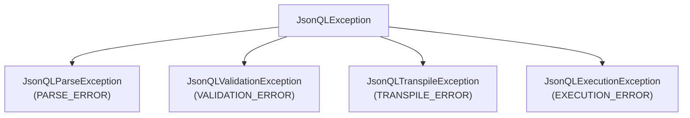

The official Java SDK for JSONQL. Configure a connection, register the adapter, and your API instantly supports dynamic filtering, sorting, pagination, field selection, and relationships.

| | |
|---|---|
| **Group** | `org.jsonql` |
| **Artifact** | `jsonql-java` |
| **Java** | 17+ |
| **License** | MIT |
| **Spec** | JSONQL v1.1 |

## Install

### Maven

```xml
<dependency>
    <groupId>org.jsonql</groupId>
    <artifactId>jsonql-java</artifactId>
    <version>1.1.0</version>
</dependency>
```

### Gradle

```kotlin
implementation("org.jsonql:jsonql-java:1.1.0")
```

## Configure & Use

### Spring Boot

```java
import org.jsonql.adapter.AdapterOptions;
import org.jsonql.adapter.spring.SpringAdapter;
import org.springframework.web.bind.annotation.*;

import javax.sql.DataSource;

@RestController
@RequestMapping("/api")
public class JsonQLController {

    private final SpringAdapter adapter;

    public JsonQLController(DataSource ds) {
        AdapterOptions opts = new AdapterOptions()
            .connectionSupplier(ds::getConnection);

        this.adapter = new SpringAdapter(opts);
    }

    @PostMapping("/{table}")
    public Object query(@PathVariable String table, @RequestBody String body) {
        return adapter.handleQuery(table, body);
    }

    @PostMapping("/{table}/create")
    public Object create(@PathVariable String table, @RequestBody String body) {
        return adapter.handleCreate(table, body);
    }

    @PatchMapping("/{table}")
    public Object update(@PathVariable String table, @RequestBody String body) {
        return adapter.handleUpdate(table, body);
    }

    @DeleteMapping("/{table}")
    public Object delete(@PathVariable String table, @RequestBody String body) {
        return adapter.handleDelete(table, body);
    }
}
```

**That's it.** Spring Boot auto-wires your `DataSource`. All JSONQL operations route through the adapter — no query-building needed, no custom SQL.

### Jakarta Servlet (no Spring)

```java
import org.jsonql.adapter.AdapterOptions;
import org.jsonql.adapter.servlet.JsonQLServlet;

AdapterOptions opts = new AdapterOptions()
    .connectionSupplier(() -> DriverManager.getConnection(url, user, pass));

// Register servlet at /api/*
servletContext.addServlet("jsonql", new JsonQLServlet(opts))
    .addMapping("/api/*");
```

## What Your Clients Can Do

Every query is a JSON POST to `/api/{table}`:

```bash
# Select specific fields, filter, sort, paginate
curl -X POST http://localhost:8080/api/users -H 'Content-Type: application/json' -d '{
  "fields": ["id", "name", "email"],
  "where": { "status": { "eq": "active" } },
  "sort": ["-created_at"],
  "limit": 20
}'
# → { "data": [{ "id": 1, "name": "Alice", "email": "alice@co.com" }, ...] }
```

```bash
# Complex filters
curl -X POST http://localhost:8080/api/products -d '{
  "where": {
    "and": [
      { "price": { "gte": 10, "lte": 100 } },
      { "category": { "in": ["electronics", "books"] } }
    ]
  },
  "sort": ["price"],
  "limit": 50
}'
```

```bash
# Include related data
curl -X POST http://localhost:8080/api/users -d '{
  "fields": ["id", "name"],
  "include": {
    "posts": { "fields": ["title", "created_at"], "limit": 5 }
  }
}'
```

```bash
# Aggregation & groupBy
curl -X POST http://localhost:8080/api/orders -d '{
  "aggregate": { "total": { "fn": "sum", "field": "amount" } },
  "groupBy": ["status"]
}'
```

CRUD mutations:

```bash
# Create
curl -X POST http://localhost:8080/api/users/create \
  -d '{ "data": { "name": "Bob", "email": "bob@co.com" } }'

# Update
curl -X PATCH http://localhost:8080/api/users \
  -d '{ "patch": { "status": "inactive" }, "where": { "id": { "eq": 1 } } }'

# Delete
curl -X DELETE http://localhost:8080/api/users \
  -d '{ "where": { "id": { "eq": 1 } } }'
```

## Adding Schema (Optional)

Without schema, all columns are queryable. With schema, you control field exposure and enable relationships:

```java
import org.jsonql.schema.JsonQLSchema;

JsonQLSchema schema = JsonQLSchema.builder()
    .table("users", t -> t
        .field("id", "number")
        .field("name", "string")
        .field("email", "string")
        .relation("posts", r -> r.hasMany("posts", "user_id"))
    )
    .build();

AdapterOptions opts = new AdapterOptions()
    .connectionSupplier(ds::getConnection)
    .schema(schema);
```

## Lifecycle Hooks

Inject tenant isolation, audit logging, or authorization:

```java
AdapterOptions opts = new AdapterOptions()
    .connectionSupplier(ds::getConnection)
    .beforeQuery((query, table) -> {
        // Inject tenant filter into every query
        query.addWhere("tenant_id", "eq", tenantId);
    })
    .afterQuery((result, table) -> {
        auditLog.record("query", table, result.getRowCount());
    });
```

## Supported Databases

| Database | Dialect | JDBC Driver |
|----------|---------|-------------|
| **PostgreSQL** | `postgres` | `org.postgresql:postgresql` |
| **MySQL** | `mysql` | `com.mysql:mysql-connector-j` |
| **SQLite** | `sqlite` | `org.xerial:sqlite-jdbc` |
| **MSSQL** | `mssql` | `com.microsoft.sqlserver:mssql-jdbc` |
| **MongoDB** | `mongodb` | `org.mongodb:mongodb-driver-sync` |

Dialect is auto-detected from JDBC URL; explicit setting is optional:

```java
new AdapterOptions()
    .connectionSupplier(ds::getConnection)
    .dialect("postgres"); // Only needed if auto-detect fails
```

## Error Handling

All errors extend `JsonQLException` with a `getErrorCode()` method:



```java
try {
    adapter.handleQuery(table, body);
} catch (JsonQLException e) {
    System.out.println(e.getErrorCode()); // "VALIDATION_ERROR"
}
```

Adapter error responses:

```json
{ "error": "Field 'secret' is not allowed", "error_code": "VALIDATION_ERROR" }
```

## Advanced: Engine (Direct Use)

For custom pipelines outside the Spring adapter:

```java
import org.jsonql.JsonQLFactory;
import org.jsonql.JsonQLResult;

JsonQLFactory factory = JsonQLFactory.builder()
    .dialect("postgres")
    .connection(ds.getConnection())
    .schema(schema) // optional
    .build();

JsonQLResult result = factory.execute("users", queryJson);
// result.getData()        → List<Map<String, Object>>
// result.isMutation()     → boolean
```

## Advanced: Query Builder

For server-side programmatic query construction:

```java
import org.jsonql.builder.QueryBuilder;

String query = QueryBuilder.from("users")
    .select("id", "name", "email")
    .where("status", "eq", "active")
    .orderBy("-created_at")
    .limit(10)
    .toJson();
```

## Core API

| Class | Purpose |
|-------|---------|
| `AdapterOptions` | Configure adapter: connection, schema, hooks, dialect |
| `SpringAdapter` | Spring Boot request handler |
| `JsonQLFactory` | Manual transpile-and-execute pipeline |
| `JsonQLParser` | Parse & validate incoming JSON |
| `SQLTranspiler` | Convert parsed query → SQL + params |
| `Hydrator` | Convert flat rows → nested POJOs/maps |
| `QueryBuilder` | Fluent query construction (advanced) |

## Compliance

135/135 tests passing across all configurations:

| Adapter | PostgreSQL | MySQL | SQLite | MSSQL | MongoDB |
|---------|:----------:|:-----:|:------:|:-----:|:-------:|
| **Spring** | ✅ | ✅ | ✅ | ✅ | ✅ |
| **Jakarta** | ✅ | ✅ | ✅ | ✅ | ✅ |

## Development

```bash
mvn test                # Run all tests (JUnit 4 + H2)
mvn verify              # Full verification including integration tests
```

## Repo

[`github.com/jsonql-standard/jsonql-java`](https://github.com/JSONQL-Standard/jsonql-java)
