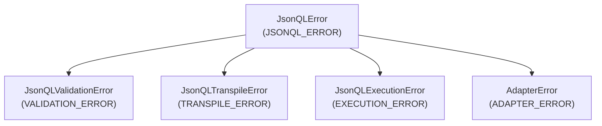

The official Python SDK for JSONQL. Pythonic query building, SQL transpilation, and framework adapters for Flask, FastAPI, and Django — with both SQL and MongoDB variants.

| | |
|---|---|
| **Package** | `jsonql` |
| **Version** | 1.1.0 |
| **Python** | 3.10+ |
| **License** | MIT |

## Features

- Pythonic `QueryBuilder` and `MutationBuilder` with condition helpers
- `Parser` for JSONQL query validation
- `SQLTranspiler` with dialect support (Postgres, MySQL, SQLite, MSSQL)
- `MongoTranspiler` for MongoDB aggregation pipelines
- `MongoDriver` for MongoDB execution
- `ResultHydrator` for nested JSON reconstruction
- `Validator` for schema-based field permission checking
- `JsonQLEngine` with builder pattern for full pipeline
- Async executor support
- Framework adapters for **Flask**, **FastAPI**, and **Django** (SQL and MongoDB variants)
- Type hints throughout (PEP 561)

## Installation

```bash
pip install jsonql-py
```

With framework extras:

```bash
pip install jsonql-py[flask]      # Flask adapter
pip install jsonql-py[fastapi]    # FastAPI + uvicorn
pip install jsonql-py[django]     # Django REST Framework
pip install jsonql-py[postgres]   # psycopg2-binary
```

> **Note:** The import name is still `import jsonql` — only the PyPI package name is `jsonql-py`.

## Quick Start

### Query Builder

```python
from jsonql import QueryBuilder
from jsonql.conditions import eq, gt, field, and_

query = (
    QueryBuilder()
    .from_table("users")
    .select("id", "name", "email")
    .where(and_(
        field("age", gt(18)),
        field("status", eq("active")),
    ))
    .order_by("name", "-age")
    .limit(10)
    .build()
)
```

### Mutation Builder

```python
from jsonql import MutationBuilder

# Create
mutation = MutationBuilder().create({"name": "Alice", "age": 30}).build()

# Update
mutation = (
    MutationBuilder()
    .update({"name": "Bob"})
    .where({"id": {"eq": 1}})
    .build()
)

# Delete
mutation = MutationBuilder().delete().where({"id": {"eq": 1}}).build()
```

### Transpiler

```python
from jsonql import Parser, SQLTranspiler

parser = Parser()
query = parser.parse({
    "fields": ["id", "name"],
    "where": {"status": {"eq": "active"}},
    "sort": ["-name"],
    "limit": 10,
})

transpiler = SQLTranspiler("postgres")
result = transpiler.transpile(query, "users")
print(result.sql)
# SELECT "users"."id", "users"."name" FROM "users"
#   WHERE "users"."status" = $1 ORDER BY "users"."name" DESC LIMIT 10
print(result.args)  # ['active']
```

### Schema Validation

```python
from jsonql import Validator, JsonQLQuery
from jsonql.types import JsonQLSchema, JsonQLTable, JsonQLField

schema = JsonQLSchema(tables={
    "users": JsonQLTable(fields={
        "id": JsonQLField(type="integer"),
        "name": JsonQLField(type="string"),
        "secret": JsonQLField(type="string", allow_select=False),
    }),
})

validator = Validator(schema, "users")
result = validator.validate(JsonQLQuery(fields=["id", "name"]))
assert result.valid

# Raises JsonQLValidationError
validator.validate_or_raise(JsonQLQuery(fields=["secret"]))
```

### Engine (Full Pipeline)

```python
from jsonql import JsonQLEngine
from jsonql.types import parse_schema

schema = parse_schema({...})

async def run_sql(sql: str, params: list) -> list[dict]:
    # Your database execution logic
    ...

engine = (
    JsonQLEngine.builder()
    .postgres()
    .schema(schema)
    .executor(run_sql)
    .build()
)
```

### Flask Adapter

```python
from flask import Flask
from jsonql.adapters import create_flask_blueprint, AdapterOptions

app = Flask(__name__)
bp = create_flask_blueprint(AdapterOptions(
    dialect="sqlite",
    execute=run_sql,
    schema=my_schema,
))
app.register_blueprint(bp, url_prefix="/jsonql")
```

### FastAPI Adapter

```python
from fastapi import FastAPI
from jsonql.adapters import create_fastapi_router, AdapterOptions

app = FastAPI()
router = create_fastapi_router(AdapterOptions(
    dialect="postgres",
    execute=run_sql,
    schema=my_schema,
))
app.include_router(router, prefix="/jsonql")
```

### Django Adapter

```python
# urls.py
from django.urls import path
from jsonql.adapters import JsonQLDjangoView, AdapterOptions

options = AdapterOptions(
    dialect="postgres", execute=run_sql, schema=my_schema
)

urlpatterns = [
    path("jsonql/", JsonQLDjangoView.as_view(options=options)),
    path("jsonql/<path:path>/", JsonQLDjangoView.as_view(options=options)),
]
```

## Core API

| Export | Purpose |
|--------|---------|
| `Parser` | Parse & validate incoming JSON |
| `SQLTranspiler` | Convert parsed query → SQL + params |
| `Validator` | Schema-based permission checking |
| `QueryBuilder` | Fluent query construction |
| `MutationBuilder` | Fluent mutation construction |
| `ResultHydrator` | Flatten SQL joins → nested JSON |
| `JsonQLEngine` | Full pipeline with builder pattern |
| `JsonQLError` | Base error with `code` and `message` |
| `JsonQLValidationError` | Validation failures with `errors` detail |
| `JsonQLTranspileError` | SQL/Mongo transpilation errors |
| `JsonQLExecutionError` | Database execution errors with chained `__cause__` |
| `AdapterError` | HTTP adapter errors with `status` code |

## Condition Helpers

```python
from jsonql.conditions import (
    eq, neq, gt, gte, lt, lte,
    is_in, not_in, like, contains, starts_with, ends_with,
    field, and_, or_, not_,
)
```

## Supported Dialects

| Dialect | Placeholder | Quoting | RETURNING |
|---------|-------------|---------|-----------|
| `postgres` | `$1, $2` | `"col"` | ✅ |
| `mysql` | `?, ?` | `` `col` `` | ❌ |
| `sqlite` | `?, ?` | `"col"` | ❌ |
| `mssql` | `@p1, @p2` | `[col]` | ❌ |

### MongoDB

The Python SDK includes a `MongoTranspiler` and `MongoDriver` for MongoDB support, along with dedicated MongoDB adapter variants for each framework (`flask_mongo`, `fastapi_mongo`, `django_mongo`).

## Error Handling

All errors extend `JsonQLError` and include a machine-readable `code` for programmatic handling:



```python
try:
    result = engine.execute("users", query)
except JsonQLValidationError as e:
    print(e.code)    # "VALIDATION_ERROR"
    print(e.errors)  # [ValidationError(...)]
except JsonQLError as e:
    print(e.code)    # "JSONQL_ERROR" (base)
```

Framework adapters include the `error_code` field in error responses:

```json
{
  "error": "Field 'secret' is not allowed",
  "error_code": "VALIDATION_ERROR"
}
```

## Compliance

All 3 framework adapters × 5 databases + 3 lifecycle containers = **18 configurations** pass **135/135** compliance tests.

| Adapter | PostgreSQL | MySQL | SQLite | MSSQL | MongoDB |
|---------|:----------:|:-----:|:------:|:-----:|:-------:|
| **Flask** | ✅ 135/135 | ✅ 135/135 | ✅ 135/135 | ✅ 135/135 | ✅ 135/135 |
| **FastAPI** | ✅ 135/135 | ✅ 135/135 | ✅ 135/135 | ✅ 135/135 | ✅ 135/135 |
| **Django** | ✅ 135/135 | ✅ 135/135 | ✅ 135/135 | ✅ 135/135 | ✅ 135/135 |

Lifecycle tests (Flask, FastAPI, Django × PostgreSQL) also pass.

## Development

### Setup & Test

```bash
pip install -e ".[dev]"   # Install in editable mode with dev deps
pytest                    # Run all tests
```

### Formatting & Linting

The Python SDK uses [Ruff](https://docs.astral.sh/ruff/) for formatting and linting (rules: E/F/I/W, line-length 100, target py310). Both are enforced in CI.

```bash
ruff format .             # Auto-format all Python files
ruff format --check .     # Check formatting (CI runs this)
ruff check .              # Lint check (CI runs this)
```

### Pre-commit Hook

A pre-commit hook runs Ruff format and lint checks before each commit. To install:

```bash
cp hooks/pre-commit .git/hooks/pre-commit
chmod +x .git/hooks/pre-commit
```

### CI Pipeline

The GitHub Actions CI runs two jobs:

1. **lint** — `ruff format --check` + `ruff check` (format + lint verification)
2. **test** — `pytest` on Python 3.10 and 3.12 (gated by lint)

## Repo

[`github.com/jsonql-standard/jsonql-py`](https://github.com/JSONQL-Standard/jsonql-py)
