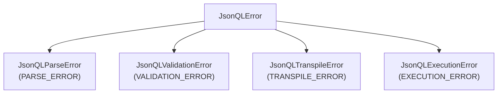

The official Python SDK for JSONQL. Two lines of configuration give your API dynamic filtering, sorting, pagination, field selection, and relationships — no custom views needed.

| | |
|---|---|
| **Package** | `jsonql-py` |
| **Python** | 3.10+ |
| **License** | MIT |
| **Spec** | JSONQL v1.1 |

## Install

```bash
pip install jsonql-py
```

With framework extras:

```bash
pip install "jsonql-py[flask]"      # Flask adapter
pip install "jsonql-py[fastapi]"    # FastAPI adapter
pip install "jsonql-py[django]"     # Django adapter
```

## Configure & Use

Pick your framework — two lines wire up a complete JSONQL API:

### Flask

```python
from flask import Flask
from jsonql.adapters.flask import create_flask_blueprint
from jsonql.adapters.options import AdapterOptions

app = Flask(__name__)

opts = AdapterOptions(execute=lambda sql, params: db.execute(sql, params).fetchall())
bp = create_flask_blueprint(opts)
app.register_blueprint(bp, url_prefix="/api")

app.run(port=8080)
```

### FastAPI

```python
from fastapi import FastAPI
from jsonql.adapters.fastapi import create_fastapi_router
from jsonql.adapters.options import AdapterOptions

app = FastAPI()

opts = AdapterOptions(execute=lambda sql, params: db.execute(sql, params).fetchall())
router = create_fastapi_router(opts)
app.include_router(router, prefix="/api")
```

### Django

```python
# urls.py
from jsonql.adapters.django import create_django_urls
from jsonql.adapters.options import AdapterOptions

opts = AdapterOptions(execute=lambda sql, params: cursor.execute(sql, params).fetchall())

urlpatterns = [
    path("api/", include(create_django_urls(opts))),
]
```

**That's it.** One execute function, one router mount. Your clients can now query any table dynamically.

## What Your Clients Can Do

Every query is a JSON POST to `/api/{table}`:

```bash
# Select specific fields, filter, sort, paginate
curl -X POST http://localhost:8080/api/users -H 'Content-Type: application/json' -d '{
  "fields": ["id", "name", "email"],
  "where": { "status": { "eq": "active" } },
  "sort": ["-created_at"],
  "limit": 20
}'
# → { "data": [{ "id": 1, "name": "Alice", "email": "alice@co.com" }, ...] }
```

```bash
# Complex filters
curl -X POST http://localhost:8080/api/products -d '{
  "where": {
    "and": [
      { "price": { "gte": 10, "lte": 100 } },
      { "category": { "in": ["electronics", "books"] } }
    ]
  },
  "sort": ["price"],
  "limit": 50
}'
```

```bash
# Include related data
curl -X POST http://localhost:8080/api/users -d '{
  "fields": ["id", "name"],
  "include": {
    "posts": { "fields": ["title", "created_at"], "limit": 5 }
  }
}'
```

```bash
# Aggregation & groupBy
curl -X POST http://localhost:8080/api/orders -d '{
  "aggregate": { "total": { "fn": "sum", "field": "amount" } },
  "groupBy": ["status"]
}'
```

CRUD mutations:

```bash
# Create
curl -X POST http://localhost:8080/api/users \
  -d '{ "data": { "name": "Bob", "email": "bob@co.com" } }'

# Update
curl -X PATCH http://localhost:8080/api/users \
  -d '{ "patch": { "status": "inactive" }, "where": { "id": { "eq": 1 } } }'

# Delete
curl -X DELETE http://localhost:8080/api/users \
  -d '{ "where": { "id": { "eq": 1 } } }'
```

## Adding Schema (Optional)

Without schema, all columns are queryable. With schema, you control field exposure and enable relationship resolution:

```python
from jsonql.schema import Schema, Table, Field, Relation

schema = Schema(tables={
    "users": Table(
        fields={
            "id": Field(type="number"),
            "name": Field(type="string"),
            "email": Field(type="string"),
        },
        relations={
            "posts": Relation(type="hasMany", table="posts", field="user_id"),
        },
    ),
})

opts = AdapterOptions(execute=run_sql, schema=schema)
```

## Lifecycle Hooks

Inject tenant isolation, audit logging, or authorization:

```python
def before_query(query: dict, table: str) -> dict:
    """Add tenant filter to every query."""
    query["where"] = {
        "and": [query.get("where", {}), {"tenant_id": {"eq": current_tenant()}}]
    }
    return query

opts = AdapterOptions(
    execute=run_sql,
    before_query=before_query,
    after_query=lambda result, table: audit_log(table, len(result)),
)
```

## Supported Databases

| Database | Dialect | Python Driver |
|----------|---------|---------------|
| **PostgreSQL** | `postgres` | `psycopg2` / `asyncpg` |
| **MySQL** | `mysql` | `mysql-connector-python` / `pymysql` |
| **SQLite** | `sqlite` | `sqlite3` (stdlib) |
| **MSSQL** | `mssql` | `pyodbc` / `pymssql` |
| **MongoDB** | `mongodb` | `pymongo` |

Dialect is auto-detected from connection; explicit setting is optional:

```python
opts = AdapterOptions(execute=run_sql, dialect="postgres")
```

## Error Handling

All errors inherit from `JsonQLError` with an `error_code` attribute:



```python
from jsonql.errors import JsonQLError, JsonQLValidationError

try:
    result = engine.execute("users", query)
except JsonQLValidationError as e:
    print(e.error_code)  # "VALIDATION_ERROR"
except JsonQLError as e:
    print(e.error_code)  # Any JSONQL error
```

Adapter error responses:

```json
{ "error": "Field 'secret' is not allowed", "error_code": "VALIDATION_ERROR" }
```

## Advanced: Engine (Direct Use)

For custom pipelines outside the framework adapters:

```python
from jsonql import JsonQLEngine

engine = JsonQLEngine(execute=run_sql, dialect="postgres", schema=schema)

result = engine.execute("users", {
    "where": {"status": {"eq": "active"}},
    "fields": ["id", "name"],
    "limit": 10,
})
# result["data"]         → list of dicts
# result["is_mutation"]  → bool
```

## Advanced: Query Builder

For server-side programmatic query construction:

```python
from jsonql.builder import QueryBuilder

query = (
    QueryBuilder("users")
    .select("id", "name", "email")
    .where({"status": {"eq": "active"}})
    .order_by("-created_at")
    .limit(10)
    .build()
)
```

With condition helpers:

```python
from jsonql.builder import eq, gt, in_list

query = (
    QueryBuilder("products")
    .where({"price": gt(10), "category": in_list(["books", "electronics"])})
    .build()
)
```

## Core API

| Class | Purpose |
|-------|---------|
| `AdapterOptions` | Configure adapter: execute, schema, hooks, dialect |
| `create_flask_blueprint()` | Flask route blueprint |
| `create_fastapi_router()` | FastAPI route factory |
| `JsonQLEngine` | Manual transpile-and-execute pipeline |
| `Parser` | Parse & validate incoming JSON |
| `Transpiler` | Convert parsed query → SQL + params |
| `Hydrator` | Convert flat rows → nested dicts |
| `QueryBuilder` | Fluent query construction (advanced) |

## Compliance

135/135 tests passing across all configurations:

| Adapter | PostgreSQL | MySQL | SQLite | MSSQL | MongoDB |
|---------|:----------:|:-----:|:------:|:-----:|:-------:|
| **Flask** | ✅ | ✅ | ✅ | ✅ | ✅ |
| **FastAPI** | ✅ | ✅ | ✅ | ✅ | ✅ |
| **Django** | ✅ | ✅ | ✅ | ✅ | ✅ |

## Development

```bash
pytest                    # Run all tests
ruff check .              # Lint (rules E/F/I/W)
mypy src/                 # Type checking (strict)
```

## Repo

[`github.com/jsonql-standard/jsonql-py`](https://github.com/JSONQL-Standard/jsonql-py)
