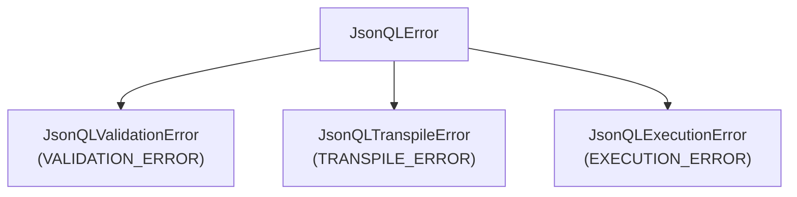

The official Node.js/TypeScript SDK for JSONQL. One line of configuration gives your API dynamic filtering, sorting, pagination, field selection, and relationships — no custom endpoints needed.

| | |
|---|---|
| **Package** | `@jsonql-standard/jsonql-ts` |
| **Version** | 1.1.0 |
| **License** | MIT |
| **Runtime** | Node.js 18+ |

## Install

```bash
npm install @jsonql-standard/jsonql-ts
```

## Configure & Use

Pick your framework — **one mount** gives you a complete JSONQL API:

### Express

```typescript
import express from 'express';
import { jsonqlExpress } from '@jsonql-standard/jsonql-ts';
import { PostgresDriver } from '@jsonql-standard/jsonql-ts/drivers/postgres';

const app = express();
app.use(express.json());

const driver = new PostgresDriver('postgres://localhost/mydb');

// One line of config — dynamic query API ready
app.use('/api', jsonqlExpress({ driver }));

app.listen(3000);
```

### Fastify

```typescript
import Fastify from 'fastify';
import { jsonqlFastify } from '@jsonql-standard/jsonql-ts';
import { PostgresDriver } from '@jsonql-standard/jsonql-ts/drivers/postgres';

const fastify = Fastify();
const driver = new PostgresDriver('postgres://localhost/mydb');

// Auto-registers /:table routes
fastify.register(jsonqlFastify, { driver });

fastify.listen({ port: 3000 });
```

### NestJS

```typescript
import { Module } from '@nestjs/common';
import { JsonqlModule } from '@jsonql-standard/jsonql-ts';

@Module({
  imports: [
    JsonqlModule.forRoot({
      driver: new PostgresDriver('postgres://localhost/mydb'),
    }),
  ],
})
export class AppModule {}
```

**That's it.** No query controllers, no endpoint-per-filter, no route boilerplate. Your clients can now query any table dynamically.

## What Your Clients Can Do

Every query is a JSON POST to `/api/{table}`:

```bash
# Select specific fields, filter, sort, paginate
curl -X POST http://localhost:3000/api/users -H 'Content-Type: application/json' -d '{
  "fields": ["id", "name", "email"],
  "where": { "status": { "eq": "active" } },
  "sort": ["-created_at"],
  "limit": 20
}'
# → { "data": [{ "id": 1, "name": "Alice", "email": "alice@co.com" }, ...] }
```

```bash
# Complex filters with AND/OR
curl -X POST http://localhost:3000/api/products -d '{
  "where": {
    "and": [
      { "price": { "gte": 10, "lte": 100 } },
      { "category": { "in": ["electronics", "books"] } }
    ]
  },
  "sort": ["price"],
  "limit": 50
}'
```

```bash
# Include related data — joins resolved automatically
curl -X POST http://localhost:3000/api/users -d '{
  "fields": ["id", "name"],
  "include": {
    "posts": { "fields": ["title", "created_at"], "limit": 5 }
  }
}'
# → { "data": [{ "id": 1, "name": "Alice", "posts": [{ "title": "Hello", ... }] }] }
```

```bash
# Aggregation & groupBy
curl -X POST http://localhost:3000/api/orders -d '{
  "aggregate": { "total": { "fn": "sum", "field": "amount" } },
  "groupBy": ["status"]
}'
```

CRUD mutations work too:

```bash
# Create (POST with "data")
curl -X POST http://localhost:3000/api/users \
  -d '{ "data": { "name": "Bob", "email": "bob@co.com" } }'

# Update (PATCH)
curl -X PATCH http://localhost:3000/api/users \
  -d '{ "patch": { "status": "inactive" }, "where": { "id": { "eq": 1 } } }'

# Delete
curl -X DELETE http://localhost:3000/api/users \
  -d '{ "where": { "id": { "eq": 1 } } }'
```

## Adding Schema (Optional)

Without schema, all columns are queryable. With schema, you control which fields are exposed, hide sensitive columns, and enable relationship resolution:

```typescript
app.use('/api', jsonqlExpress({
  driver,
  schema: {
    tables: {
      users: {
        fields: {
          id:     { type: 'number' },
          name:   { type: 'string' },
          email:  { type: 'string' },
          secret: { type: 'string', allowSelect: false }, // hidden from queries
        },
        relations: {
          posts: { type: 'hasMany', table: 'posts', field: 'user_id' },
        },
      },
      posts: {
        fields: {
          id:      { type: 'number' },
          title:   { type: 'string' },
          user_id: { type: 'number' },
        },
      },
    },
  },
}));
```

## Lifecycle Hooks

Inject logic at any point in the pipeline — tenant isolation, audit logging, RLS:

```typescript
app.use('/api', jsonqlExpress({
  driver,
  hooks: {
    beforeQuery: (query, table) => {
      query.where = { ...query.where, tenant_id: { eq: currentTenantId } };
    },
    afterQuery: (results) => results,
  },
}));
```

## Supported Databases

| Database | Driver import | Package |
|----------|-------------|---------|
| **PostgreSQL** | `drivers/postgres` | `pg` |
| **MySQL** | `drivers/mysql` | `mysql2` |
| **SQLite** | `drivers/sqlite` | `sqlite3` |
| **MSSQL** | `drivers/mssql` | `mssql` |
| **MongoDB** | `drivers/mongodb` | `mongodb` |

## Error Handling

All errors include a machine-readable `error_code`:



```json
{ "error": "Field 'secret' is not allowed", "error_code": "VALIDATION_ERROR" }
```

## Advanced: Query Builder

For server-side programmatic query construction:

```typescript
import { JSONQLQueryBuilder } from '@jsonql-standard/jsonql-ts';

const query = new JSONQLQueryBuilder()
  .from('users')
  .select('id', 'name')
  .where({ status: { eq: 'active' } })
  .orderBy('-created_at')
  .limit(10)
  .build();
```

## Advanced: Low-Level Transpiler

Use the transpiler directly for custom pipelines:

```typescript
import { SQLTranspiler } from '@jsonql-standard/jsonql-ts';

const transpiler = new SQLTranspiler('postgres');
const { sql, parameters } = transpiler.transpile(query, 'users');
// → SELECT "users"."id", "users"."name" FROM "users" WHERE "users"."status" = $1
```

## Core API

| Export | Purpose |
|--------|---------|
| `jsonqlExpress()` | Express middleware — mount and go |
| `jsonqlFastify` | Fastify plugin with auto-routing |
| `JsonqlModule` | NestJS module with injectable service |
| `JSONQLParser` | Parse & validate incoming JSON |
| `SQLTranspiler` | Convert parsed query → SQL + params |
| `ResultHydrator` | Flatten SQL joins → nested JSON |
| `JSONQLQueryBuilder` | Fluent query construction (advanced) |
| `JSONQLMutationBuilder` | Fluent mutation construction (advanced) |
| `SchemaManager` | Load schemas from introspection + JSON |

## Compliance

135/135 tests passing across all configurations:

| Adapter | PostgreSQL | MySQL | SQLite | MSSQL |
|---------|:----------:|:-----:|:------:|:-----:|
| **Express** | ✅ | ✅ | ✅ | ✅ |
| **Fastify** | ✅ | ✅ | ✅ | ✅ |
| **NestJS** | ✅ | ✅ | ✅ | ✅ |

## Development

```bash
npm install && npm test       # Install + test
npx prettier --check .        # Format check (CI enforced)
```

## Architecture

The SDK is organised into 12 canonical modules. A request flows through them in order:

```
parser → validator → transpiler → driver → drivers → hydrator
                            ↑ factory wires it together
                            ↑ builder is an alternative input
```

| Module | File | Purpose |
|--------|------|---------|
| **parser** | `src/parser/` | Tokenise & validate incoming JSON, produce an AST |
| **validator** | `src/validator/` | Schema & permission checks against the AST |
| **transpiler** | `src/transpiler/` | AST → parameterised SQL for the active dialect |
| **mongo_transpiler** | `src/transpiler/mongo.ts` | AST → MongoDB filter & aggregation pipelines |
| **dialect** | `src/transpiler/dialect.ts` | Per-flavour quoting & parameter markers (Postgres `$1`, MySQL/SQLite `?`, MSSQL `@p1`) |
| **driver** | `src/driver.ts` | Orchestrates execute → retry → diagnostics |
| **drivers** | `src/drivers/` | Concrete backends: `postgres`, `mysql`, `sqlite`, `mssql`, `mongodb` |
| **hydrator** | `src/hydrator.ts` | Flatten join rows back into nested JSON |
| **factory** | `src/core.ts` (`createJsonql()` helper) | One-call wiring of parser + transpiler + driver + hydrator |
| **builder** | `src/builder/` | Fluent `JSONQLQueryBuilder` / `JSONQLMutationBuilder` |
| **schema** | `src/schema/` | Optional schema loader (introspection + JSON) |
| **adapters** | `src/adapters/` | Framework integrations: `express`, `fastify`, `nestjs` |
| **errors** | `src/errors.ts` | `JsonQLError` hierarchy with `error_code` |

For most apps you only touch **adapters** at install time and the **factory** for advanced wiring. Everything else is automatic.

## Repo

[`github.com/jsonql-standard/jsonql-ts`](https://github.com/JSONQL-Standard/jsonql-ts)
