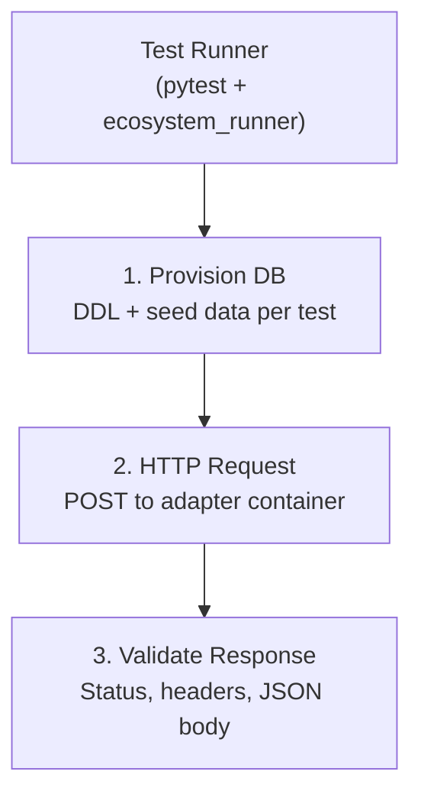

Every JSONQL SDK and adapter is tested against the same compliance suite to guarantee consistent behavior, regardless of language, framework, or database.

## At a Glance

| Metric | Value |
|--------|-------|
| **SDKs** | 4 (Go, TypeScript, Java, Python) |
| **Frameworks** | 9 implemented (Gin, Echo, net/http, Express, Fastify, NestJS, Flask, FastAPI, Django); 6 compliance-tested |
| **Databases** | 3 (PostgreSQL, MySQL, SQLite) |
| **Total containers** | 18 (6 adapters × 3 databases) |
| **Tests per container** | 65 |
| **Total test executions** | 1,170 |

## Test Matrix

Every SDK is tested against every combination of its supported frameworks and databases:

### Go SDK (9 containers)

| Adapter | PostgreSQL | MySQL | SQLite |
|---------|:----------:|:-----:|:------:|
| **Gin** | ✅ 65/65 | ✅ 65/65 | ✅ 65/65 |
| **Echo** | ✅ 65/65 | ✅ 65/65 | ✅ 65/65 |
| **net/http** | ✅ 65/65 | ✅ 65/65 | ✅ 65/65 |

### TypeScript SDK (9 containers)

| Adapter | PostgreSQL | MySQL | SQLite |
|---------|:----------:|:-----:|:------:|
| **Express** | ✅ 65/65 | ✅ 65/65 | ✅ 65/65 |
| **Fastify** | ✅ 65/65 | ✅ 65/65 | ✅ 65/65 |
| **NestJS** | ✅ 65/65 | ✅ 65/65 | ✅ 65/65 |

### Java SDK

The Java SDK provides core engine functionality (transpiler, builder, engine, lifecycle hooks) but does not yet have framework adapters. Compliance testing will be added when adapters are available.

### Python SDK

The Python SDK has Flask, FastAPI, and Django adapters implemented but they are not yet integrated into the `jsonql-tests` compliance suite.

## Test Categories

The 65 compliance tests are organized into 11 categories:

| Category | Tests | Validates |
|----------|:-----:|-----------|
| **Basic** | 8 | Simple queries, field selection, health endpoints |
| **Parsing** | 4 | Query parameter parsing, body parsing, edge cases |
| **Validation** | 5 | Schema validation, field permissions, error responses |
| **Features v1.1** | 6 | Aggregation, groupBy, distinct |
| **Advanced** | 2 | Complex queries, nested conditions |
| **Errors** | 2 | Error handling, invalid query responses |
| **Execution** | 3 | Query execution, mutation handling |
| **Lifecycle** | 11 | Hooks, filters, sorting, pagination, relationships |
| **Misc** | 14 | Edge cases, operator coverage, string filters |
| **Parser Options** | 8 | Security limits, max depth, max limit |
| **Scenarios** | 2 | End-to-end real-world usage patterns |

## How It Works

### Architecture



Each test case is a JSON fixture that defines:
- **Setup**: DDL statements and seed data to provision before the test
- **Request**: HTTP method, path, headers, and body
- **Expected**: Status code, response body (deep comparison), and optional header checks

### Test Fixtures

Test fixtures live in `jsonql-tests/tests/unified/` and are organized by category:

```
tests/unified/
├── basic/
│   ├── cases/
│   │   ├── basic.json
│   │   └── field-selection.json
│   └── fixtures/
├── lifecycle/
│   ├── cases/
│   │   ├── filtering.json
│   │   ├── sorting.json
│   │   └── ...
│   └── fixtures/
├── features-v1-1/
│   ├── cases/
│   │   └── aggregation.json
│   └── fixtures/
└── ...
```

### Running Tests

#### Full Suite (Sequential)

```bash
cd jsonql-tests
./run_tests.sh
```

#### Filtered by SDK

```bash
./run_tests.sh --target go      # All Go adapters
./run_tests.sh --target ts      # All TypeScript adapters
```

#### Filtered by Framework

```bash
./run_tests.sh --target gin     # Go Gin × all DBs
./run_tests.sh --target express # TS Express × all DBs
```

#### Filtered by Database

```bash
./run_tests.sh --target pg      # All adapters × PostgreSQL
./run_tests.sh --target mysql   # All adapters × MySQL
./run_tests.sh --target sqlite  # All adapters × SQLite
```

#### Docker Compose

```bash
docker compose up --build runner
```

## CI Pipeline

Compliance tests run automatically on every push via GitHub Actions:

- **ci.yml** — Sequential test execution (`run_tests.sh`) on every push
- **nightly-matrix.yml** — Parallel matrix strategy testing each adapter independently

## Adding a New Adapter

To add compliance testing for a new SDK or framework adapter:

1. Create a new adapter directory in `jsonql-tests/adapters/`
2. Implement the standard JSONQL HTTP contract (POST `/{table}`, GET `/{table}`, etc.)
3. Add a Dockerfile and docker-compose service
4. Add the adapter to `run_tests.sh` and the CI matrix
5. Run the compliance suite and verify 65/65 passing

## Repo

[`github.com/jsonql-standard/jsonql-tests`](https://github.com/JSONQL-Standard/jsonql-tests)
